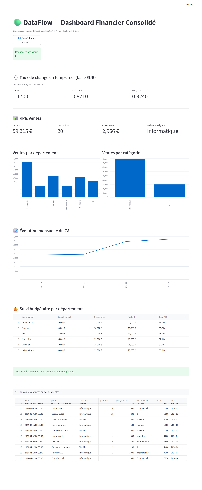

# 🟢 DataFlow — Pipeline ETL & Dashboard Financier Temps Réel

> Projet personnel réalisé dans le cadre d'une formation MBA Big Data & IA
> pour développer des compétences concrètes en Data Engineering et visualisation.

---

## 📌 Problématique

Une direction financière veut consolider automatiquement des données
provenant de plusieurs sources hétérogènes dans un dashboard mis à jour
en temps réel — sans intervention manuelle.

DataFlow automatise ce cycle de bout en bout : extraction depuis 3 sources,
transformation, chargement dans une base analytique, et restitution dans
un dashboard interactif.

---

## 🔄 Architecture ETL

```
[CSV local — Ventes]
[API publique — Taux de change]   →   [ETL Python]   →   [DuckDB]   →   [Dashboard Streamlit]
[SQLite — Budgets départements]
```

---

## 📊 Sources de données

| Source | Type | Contenu |
|---|---|---|
| `ventes.csv` | Fichier local | 20 transactions de vente sur 4 mois |
| exchangerate-api.com | API publique | Taux de change EUR/USD, GBP, CHF en temps réel |
| `dataflow.db` | SQLite | Budgets annuels par département |

---

## 🖥️ Dashboard

Le dashboard Streamlit consolide les 3 sources et affiche :

- **Taux de change** en temps réel avec date de dernière mise à jour
- **KPIs ventes** : CA total, nombre de transactions, panier moyen, meilleure catégorie
- **Ventes par département et par catégorie** — graphiques à barres
- **Évolution mensuelle du CA** — graphique linéaire
- **Suivi budgétaire** — tableau avec alertes automatiques si > 70% consommé
- **Données brutes** — section dépliable pour accéder aux données sources



---

## 🚀 Installation & Lancement

```bash
# 1. Cloner le repo
git clone https://github.com/ton-profil/dataflow.git
cd dataflow

# 2. Installer les dépendances
pip install -r requirements.txt

# 3. Initialiser la base SQLite
python setup_db.py

# 4. Lancer le pipeline ETL
python src/etl.py

# 5. Lancer le dashboard
python -m streamlit run src/dashboard.py
```

---

## 🛠️ Stack technique

| Outil | Rôle |
|---|---|
| Python · pandas | Extraction et transformation des données |
| DuckDB | Base de données analytique embarquée |
| SQLite | Stockage des budgets par département |
| requests | Appels API taux de change |
| Streamlit | Dashboard interactif temps réel |

---

## 📂 Structure du repo

```
dataflow/
├── src/
│   ├── etl.py              ← Pipeline ETL (extraction + transformation + chargement)
│   └── dashboard.py        ← Dashboard Streamlit
├── data/
│   └── ventes.csv          ← Données de ventes simulées
├── setup_db.py             ← Initialisation de la base SQLite
├── requirements.txt        ← Dépendances Python
├── .gitignore              ← Exclusion des bases de données générées
└── README.md
```

---

## 💡 Améliorations possibles

- Ajout d'un scheduler automatique (APScheduler) pour rafraîchir l'ETL toutes les heures
- Connexion à une vraie source ERP ou API comptable
- Export PDF du dashboard pour reporting automatique
- Déploiement sur Streamlit Cloud

---

## 👤 Auteur

**Déhollin HOLLAT** — Chef de Projet Data IA


